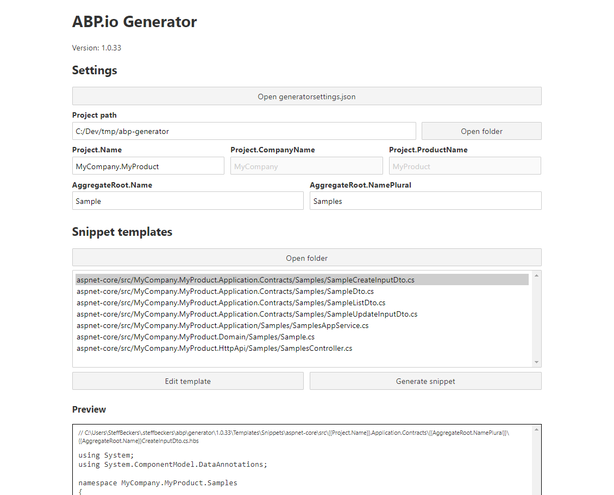

# Code generator for ABP.io projects



## Usage

```powershell
sbabpgen
```

## dotnet tool NuGet package


https://www.nuget.org/packages/SteffBeckers.Abp.Generator

### Installation

```powershell
dotnet tool install -g SteffBeckers.Abp.Generator
```

### Updates

```powershell
dotnet tool update -g SteffBeckers.Abp.Generator --no-cache
```

### Release

```powershell
dotnet pack -c Release
cd bin/Release/
dotnet nuget push SteffBeckers.Abp.Generator.x.x.x.nupkg --api-key <API key here> --source https://api.nuget.org/v3/index.json
```

OR

```powershell
publish.ps1 <API key here>
```
